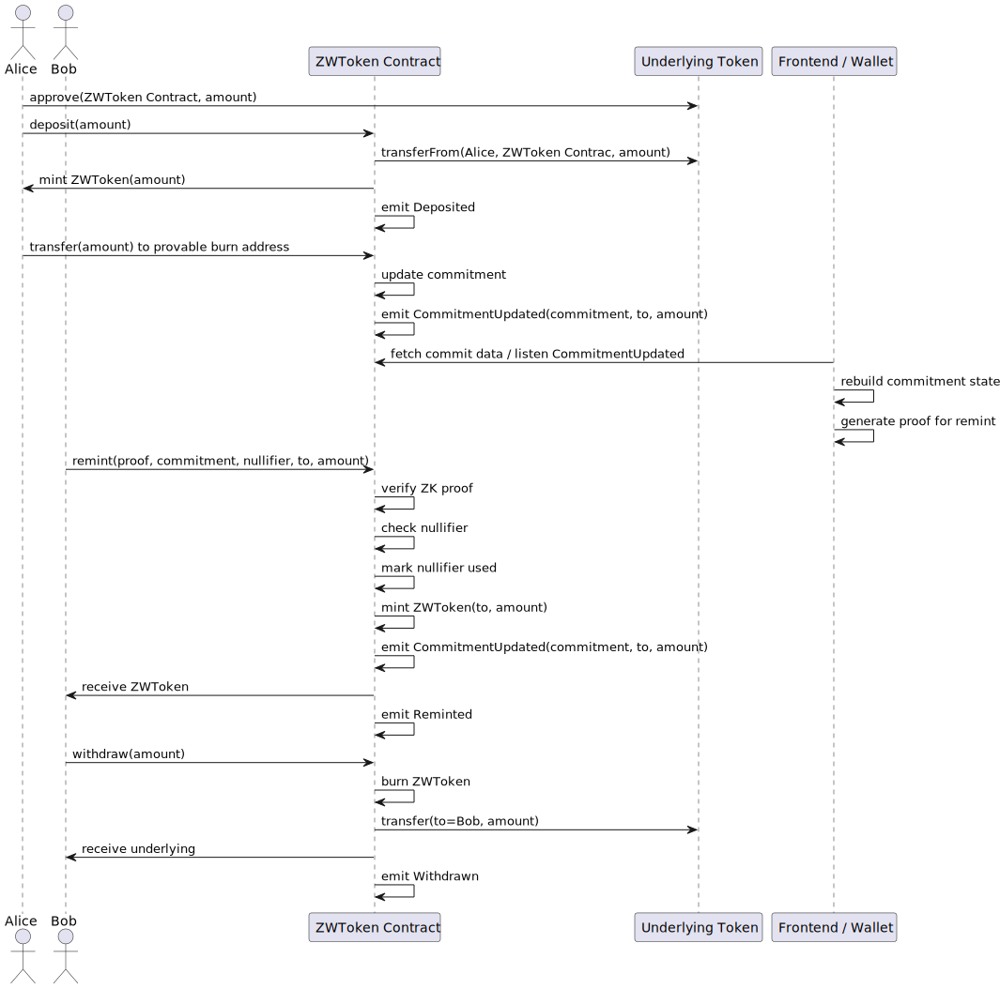

## Abstract

Most tokens including ERC-20, ERC-721, and ERC-1155 lack native privacy features due to regulatory, technical, and issuers’ disregard for privacy needs. As a result, users seeking privacy must rely on blockchains specifically designed for privacy or dApps dedicated solely to privacy, which reduces composability and limits usability. Tokens used in such systems are typically confined to closed environments, unable to interact seamlessly with the broader Ethereum ecosystem.

ERC-1004 introduces a universal Zero Knowledge Token Wrapper, which allows any existing token to gain built-in privacy by wrapping it.
By depositing a token, users mint a Zero Knowledge Wrapper token (abbreviated as ZWToken) that behaves just like the original — transferable, tradable, and composable.
On this basis, this ERC enables EIP-7503-style provable burn-and-remint flows, allowing users to break the on-chain trace of funds when desired.
Therefore, ZWToken makes privacy simple, seamless, and natively embedded in every token.

## Motivation

Privacy is not a native feature in most existing tokens due to regulatory, technical, and issuer-side neglect of privacy requirements.
Users who require privacy must rely on:

- Dedicated privacy blockchains (e.g., Zcash, Monero)
- Heavy zk-based dApps (e.g., Tornado Cash)

These approaches fragment liquidity, isolate tokens, and break interoperability with the wider Ethereum ecosystem.

This ERC allows any token (e.g., ERC-20, ERC-721, ERC-1155) to be wrapped into a privacy-preserving form, enabling privacy as a universal, token-native property.
Inspired by EIP-7503, it also allows funds to be provably “burnt” and later “reminted” through zero-knowledge proofs, breaking on-chain traceability while maintaining verifiability.

Importantly, no issuer permission is needed — any user can wrap any token into a Zero Knowledge Wrapper Token.

## Specification

The key words **MUST**, **MUST NOT**, **SHOULD**, **SHOULD NOT**, and **MAY** in this document are to be interpreted as described in RFC 2119 and RFC 8174.

### Overview

A **ZWToken** is a wrapper over an existing token (ERC-20, ERC-721, ERC-1155) that adds a _commitment-based privacy layer_.

The basic flow is as follows:


This layer supports:

- Depositing an existing token: wrapping and minting ZWToken from the underlying token.
- Transferring ZWToken: transferring ZWToken to any address, including provable burnt addresses where ZWToken can be reminted.
- Reminting ZWToken: re-minting through a zero-knowledge proof that breaks on-chain traceability.
- Withdrawing: burning ZWToken to redeem the underlying token.

The interface:

```solidity
interface IERC1004 {
    // Deposit / Wrap
    function deposit(uint256 amount) external;

    // Withdraw / Unwrap
    function withdraw(uint256 amount, bytes calldata proof) external;

    // Remint (Private-to-Public)
    function remint(bytes calldata proof) external;

    // Commitment Query
    function isKnownCommitment(bytes32 commitment) external view returns (bool);

    // Optional Data Access
    function getCommitData(uint256 index) external view returns (bytes32, address, uint256);

    // Events
    // Optional
    event CommitmentUpdated(bytes32 indexed commitment, address indexed to, uint256 amount);

    event Deposit(address indexed from, uint256 amount);
    event Withdraw(address indexed to, uint256 amount);
    event Remint(address indexed to, uint256 amount);
}
```

The commitment scheme can be implemented via **Merkle trees, accumulators, or any cryptographically verifiable structure**.

### Deposit / Wrap

```solidity
/// @notice Deposit underlying tokens and mint ZWToken
/// @param amount Amount of underlying token to deposit
function deposit(uint256 amount) external;
```

- Transfers the specified amount of the underlying token from msg.sender to the ZWToken contract.
- Mints an equivalent amount of ZWToken to msg.sender.
- For commitment schemes maintained at the contract level, no commitment update is required, because a user holding ZWToken after calling deposit is certainly not a burnt address.
- For protocol-level commitment schemes (e.g., Ethereum’s native MPT tree), the contract does not need to maintain commitments either.
- Emits Deposited(from, amount).

### Withdraw / Unwrap

```solidity
/// @notice Withdraw underlying tokens by burning ZWToken
/// @param amount Amount of ZWToken to burn and redeem underlying
function withdraw(uint256 amount) external;
```

- Burns the specified amount of ZWToken from msg.sender.
- Guarantees 1:1 redemption — Withdrawable ZWToken is always equivalent to the underlying token.
- Transfers the same amount of underlying tokens back to msg.sender.
- Emits Withdrawn(to, amount).

### Transfer and Update Commitment

- Keeps compatibility with the underlying asset’s transfer interface but extends it.
- The provable burnt address can take multiple forms, such as defined in EIP-7503. The key points are:
  - Such addresses cannot be operated by anyone; they provably do not correspond to any EOA or contract.
  - Only the generator of the burnt address can derive it, for example, through a signature-derived scheme.
- For commitment schemes maintained at the contract level, optimization is possible:
  - If the recipient is a potential provable burnt address, the contract may update the commitment only when the address first receives ZWToken.
  - If the recipient has never sent any ZWToken (since burnt addresses cannot send), the commitment is updated.
- For protocol-level commitments (e.g., Ethereum native MPT tree), the contract does not need to maintain updates.

### Remint (ZK Claim)

```solidity
/// @notice Remint ZWToken using zero-knowledge proof to unlink funds
/// @param proof ZK proof bytes
/// @param commitment Commitment or encoded block number
/// @param nullifier Prevents double-remint
/// @param to Recipient address
/// @param amount Amount of ZWToken to mint
function remint(
    bytes calldata proof,
    bytes32 commitment,
    bytes32 nullifier,
    address to,
    uint256 amount
) external;
```

- Validation includes: 1. The commitment exists
  - Verified via isKnownCommitment.
  - For protocol-level schemes (e.g., Ethereum MPT tree), the block number can be used to query the block hash as the commitment. 2. The nullifier has not been used. 3. The zero-knowledge proof is valid for the claim.
- Mints ZWToken to to (not directly to msg.sender to allow relayer support).
- For contract-level commitment schemes, since to might be a provable burnt address, the commitment needs to be updated — though the actual update timing can be optimized.
- For protocol-level commitments (using Ethereum block hashes), no update is required.
- Marks the nullifier as used to prevent replay.
- Emits:
  - CommitmentUpdated(commitment, to, amount) (if applicable)
  - Reminted(to, amount)

### Commitment Query Interfaces

```solidity
/// @notice Returns the current commitment representing privacy state
function commitment() external view returns (bytes32);

/// @notice Checks if a commitment exists
/// @param commitment_ Commitment/block number to check
function isKnownCommitment(bytes32 commitment_) external view returns (bool);

/// @notice Optional: fetch commitment data for reconstruction
/// @param startIndex Starting index
/// @param length Number of commitments
function getCommitData(uint256 startIndex, uint256 length)
    external view returns (bytes32[] memory commitments, address[] memory to, uint256[] memory amounts);
```

- commitment(): returns the current top-level privacy commitment.
- isKnownCommitment(commitment\_): returns true if the commitment exists.
  - For protocol-level commitments, block numbers can directly map to block hashes as commitments.
- getCommitData() is optional, since commitments can also be reconstructed from CommitmentUpdated events.
  - Storing commit data on-chain improves privacy and decentralization but incurs higher gas costs.
  - Event-based reconstruction requires off-chain infrastructure such as subgraphs, which introduces centralization risk.

### Events

```solidity
event Deposited(address indexed from, uint256 amount);
event Withdrawn(address indexed to, uint256 amount);
// Optional
event CommitmentUpdated(bytes32 indexed commitment, address indexed to, uint256 amount);
event Reminted(address indexed to, uint256 amount);
```

- Deposited: emitted on deposit of underlying tokens.
- Withdrawn: emitted when ZWToken is burned to redeem underlying tokens.
- CommitmentUpdated: optional. Emitted when ZWToken is sent to a potential provable burnt address, helping users reconstruct the commitment and generate proofs.
- Reminted: emitted on successful remint through a zero-knowledge proof.

## Rationale

- Commitment Generalization: Instead of binding to a single Merkle tree model, this standard uses a generic “commitment” abstraction that supports various privacy schemes.
- Permissionless Wrapping: ZWToken does not require issuer consent — any token can be wrapped.
- Dual Commitment Options: Supports either contract-maintained commitments or using blockHash as the commitment.
  - Contract-maintained commitments allow smaller ZK circuits, making proof generation feasible in browsers or mobile devices, at the cost of higher gas usage for transfers.
  - Using blockHash as commitment removes maintenance overhead but makes front-end proof generation harder.
- Modular Verification: Proofs are passed as bytes calldata, allowing use of SNARKs, STARKs, or other cryptographic systems.
- Composable Privacy: Wrapped tokens remain fully ERC-20/721/1155-compatible, enabling interoperability. Users and dApps can treat ZWToken as the underlying token when privacy is unnecessary, making privacy an optional, higher-level feature.

## Backwards Compatibility

No breaking changes to ERC-20, ERC-721, or ERC-1155.
This standard extends functionality without altering base interfaces.

## Reference Implementation

- [Demo](https://zk.walletaa.com/zwusdc)
- [PoC](https://github.com/0xNullLabs/ZWToken)

## Security Considerations

- Double-Spend Prevention: Implementations MUST mark commitments as spent after withdrawal or remint.
- Proof Soundness: The zkVerifier MUST reject invalid or reused proofs.
- Data Privacy: Off-chain relayers handling proofs SHOULD avoid leaking linkable metadata.
- Auditing: Verification logic SHOULD reside in immutable contracts.
- The protocol operates entirely on-chain, requiring no backend, and can integrate directly into wallets or dApps.
- Over-Minting Protection: The total ZWToken supply may exceed the underlying token supply, but the excess represents provably burnt tokens that do not circulate.
- Users should obtain as much commit data as possible when generating proofs to ensure privacy; otherwise, data sources might infer which commit path is of interest.
- Circuits should be as small as possible to enable users to generate proofs locally (e.g., in browsers) rather than relying on third-party provers, which may leak privacy.
- Burn amounts should appear ordinary to prevent correlation with remint amounts.
- Burn and remint times should also be separated to prevent linkability.
- Provable burnt addresses can take multiple forms (e.g., as in EIP-7503). The key points are:
  - These addresses cannot be operated and provably do not correspond to EOAs or contracts.
  - Only the generator of the burnt address can derive it, e.g., via its own signature.
  - Recommended generation methods should be zk-friendly, such as using the Poseidon hash algorithm.

## Copyright

Copyright and related rights waived via [CC0](../LICENSE.md).
