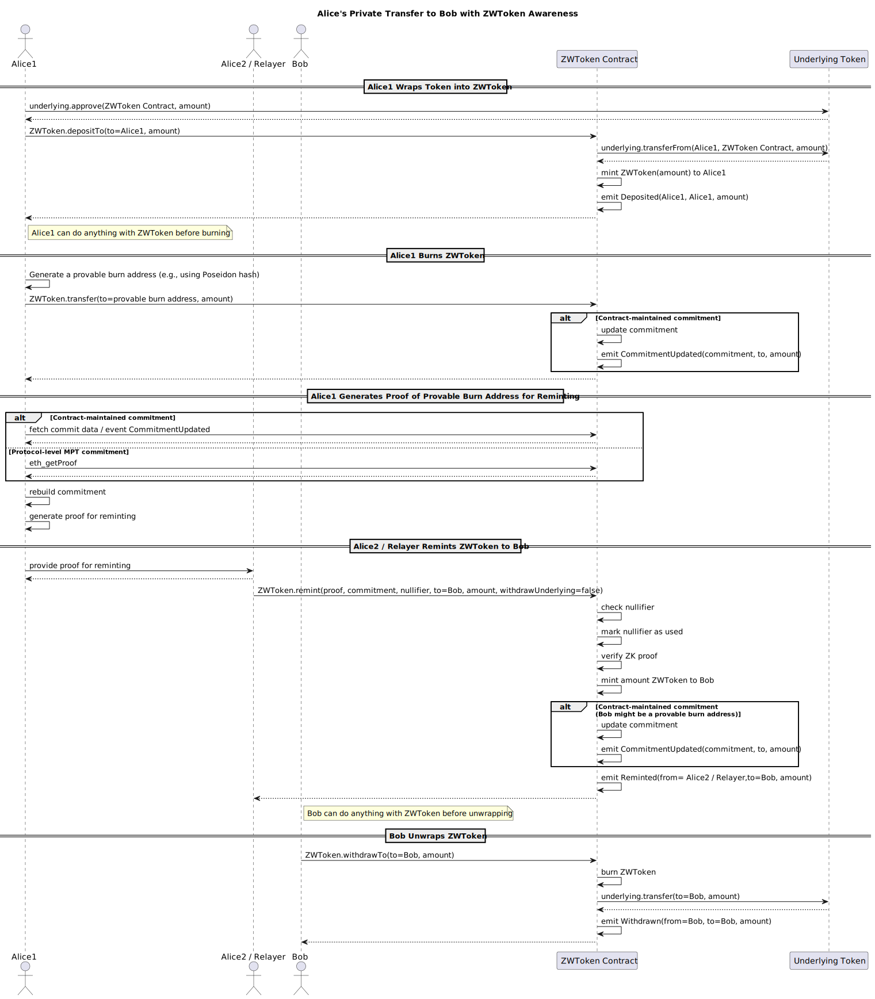
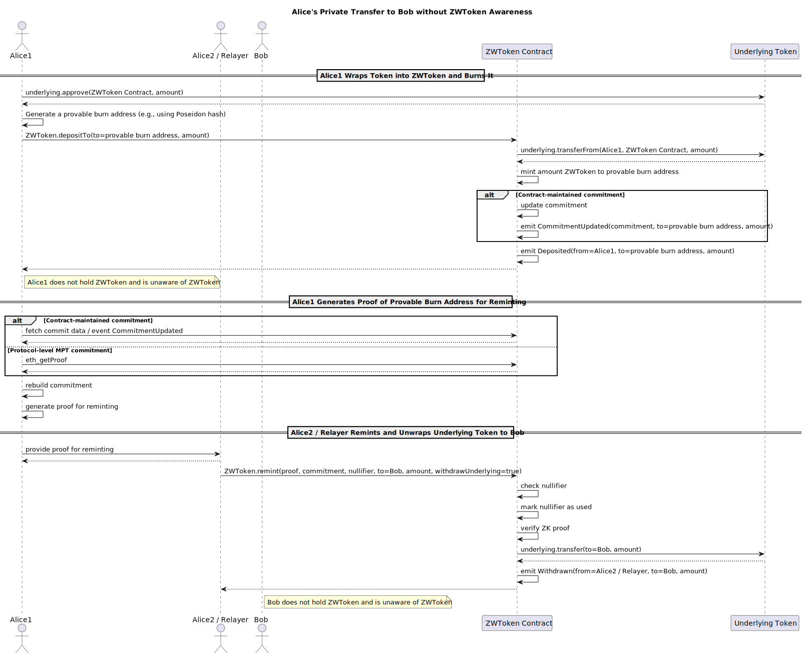

## Abstract

This ERC defines a standard for the Zero Knowledge Token Wrapper, a wrapper that adds privacy to tokens — including ERC-20, ERC-721, and ERC-1155 — while preserving all of the tokens’ original properties, such as transferability, tradability, and composability. It specifies EIP-7503-style provable burn-and-remint flows, enabling users to break on-chain traceability and making privacy a native feature of all tokens on Ethereum.

## Motivation

Most existing tokens lack native privacy due to regulatory, technical, and issuer-side neglect. Users seeking privacy must rely on dedicated privacy blockchains or privacy-focused dApps, which restrict token usability, reduce composability, limit supported token types, impose whitelists, and constrain privacy schemes.

This ERC takes a different approach by introducing a zero knowledge token wrapper that preserves the underlying token’s properties while adding privacy. Its primary goals are:

- Pluggable privacy: the wrapper preserves all properties of the underlying token while adding privacy.
- Permissionless privacy: any user can wrap any token into a Zero Knowledge Wrapper Token (ZWToken).
- Broad token support: compatible with both fungible tokens (e.g., ETH, ERC-20) and non-fungible tokens (e.g., ERC-721, ERC-1155).
- EIP-7503-style privacy: supports provable burn-and-remint flows to achieve high-level privacy.
- Compatibility with multiple EIP-7503 schemes: supports different provable burn address generation methods and commitment schemes (e.g., Ethereum-native MPT state tree or contract-managed commitments).

## Specification

The key words **MUST**, **MUST NOT**, **SHOULD**, **SHOULD NOT**, and **MAY** in this document are to be interpreted as described in RFC 2119 and RFC 8174.

### Overview

A Zero Knowledge Wrapper Token (ZWToken) is a wrapper token that adds a commitment-based privacy layer to existing tokens, including ERC-20, ERC-721, and ERC-1155. This privacy layer allows private transfers without modifying the underlying token standard, while preserving full composability with existing Ethereum infrastructure.

The commitment mechanism underlying this privacy layer may be implemented using Merkle trees, cryptographic accumulators, or any other verifiable cryptographic structure.

A ZWToken provides the following core functionalities:

- Deposit: Wraps an existing token and mints the corresponding ZWToken to the depositor.
- Transfer: Transfers ZWToken to another address, including a provable burn address where it can later be reminted.
- Remint: Mints new ZWTokens to a recipient after verifying a zero-knowledge proof demonstrating ownership of a previously burnt token without revealing the link.
- Withdraw: Burns ZWTokens to redeem the underlying tokens.

#### ZWToken-aware Workflow


In the ZWToken-aware workflow, both the user and the system explicitly recognize and interact with ZWToken. ZWToken inherits all functional properties of the underlying token.

For example, if the underlying token is ERC-20, ZWToken can be traded on DEXs, used for swaps, liquidity provision, or standard transfers. Similar to how holding WETH provides additional benefits over holding ETH directly, users may prefer to hold ZWToken rather than the underlying token.

#### ZWToken-unaware Workflow


This EIP also supports a ZWToken-unaware workflow. In this mode, all transfers are internally handled through ZWToken, but users remain unaware of its existence.

ZWToken functions transparently beneath the user interface, reducing the number of required contract interactions and improving overall user experience for those who prefer not to hold ZWToken directly.

The interface:

```solidity
interface IERC1004 {
    // Deposit / Wrap
    function depositTo(address to， uint256 amount) external payable;

    // Withdraw / Unwrap
    function withdrawTo(address to,  uint256 amount) external;

    // Remint (Private-to-Public)
    function remint(
      bytes calldata proof,
      bytes32 commitment,
      bytes32 nullifier,
      address to,
      uint256 amount,
      bool withdrawUnderlying
    ) external;

    function commitment() external view returns (bytes32);

    // Checks whether a given commitment exists
    function isCommitmentExist(bytes32 commitment) external view returns (bool);

    // Optional: Fetches the underlying data used to construct a commitment
    function getCommitData(uint256 startIndex, uint256 length) external view returns (bytes32, address, uint256);

    function getFees() external view returns (uint256 depositFee, uint256 remintFee, uint256 withdrawFee, uint256 feeDenominator);

    function getUnderlyingToken() external view returns (address);

    // Events
    // Optional: Emitted when a contract-maintained commitment is updated
    event CommitmentUpdated(bytes32 indexed commitment, address indexed to, uint256 amount);

    event Deposit(address indexed from, address indexed to, uint256 amount);

    event Withdraw(address indexed from, address indexed to, uint256 amount);

    event Remint(address indexed from, address indexed to, uint256 amount);
}
```

### Deposit / Wrap

```solidity
/// @notice Deposits a specified amount of the underlying asset and mints the corresponding amount of ZWToken to the given address.
/// @dev
/// If the underlying asset is an ERC-20/ERC-721/ERC-1155 token, the caller must approve this contract to transfer the specified `amount` beforehand.
/// If the underlying asset is ETH, the caller should send the deposit value along with the transaction (`msg.value`).
/// @param to The address that will receive the minted ZWTokens.
/// @param amount The amount of the underlying asset to deposit.
function depositTo(address to, uint256 amount) external payable;
```

- The function MUST transfer the specified `amount` of the underlying asset from msg.sender to the ZWToken contract.
  - If the underlying asset is an ERC-20, ERC-721, or ERC-1155 token, the caller MUST approve this contract to transfer the specified `amount` beforehand.
  - If the underlying asset is ETH, the caller MUST send the deposit value along with the transaction (msg.value).
- The function SHOULD mint an equivalent `amount` of ZWToken to the recipient to, reduced by applicable fees: `mintAmount = amount - amount * depositFee / feeDenominator` where depositFee and feeDenominator are obtained from the `getFees()` interface.
- Commitment Update:

  - For contract-level commitment schemes, since to may be a provable burn address, the implementation SHOULD update the corresponding commitment.
    - However, this MAY be optimized: if `to` == `msg.sender`, the implementation MAY skip updating the commitment, as `msg.sender` cannot be a provable burn address (otherwise the transaction could not be initiated).
  - For protocol-level commitment schemes (e.g., Ethereum’s native Merkle Patricia Trie), the commitment (e.g., state root or block hash) is automatically updated by the protocol.

- The function MUST emit a `Deposited(msg.sender, amount)` event upon successful deposit.

### Withdraw / Unwrap

```solidity
/// @notice Withdraw underlying tokens by burning ZWToken
/// @param amount Amount of ZWToken to burn and redeem underlying
function withdraw(address to, uint256 amount) external;
```

- Burns the specified amount of ZWToken from msg.sender.
- Guarantees 1:1 redemption — Withdrawable ZWToken is always equivalent to the underlying token.
- Transfers the same amount of underlying tokens back to msg.sender.
- Emits Withdrawn(to, amount).

### Transfer and Update Commitment

- Keeps compatibility with the underlying asset’s transfer interface but extends it.
- The provable burn address can take multiple forms, such as defined in EIP-7503. The key points are:
  - Such addresses cannot be operated by anyone; they provably do not correspond to any EOA or contract.
  - Only the generator of the burn address can derive it, for example, through a signature-derived scheme.
- For commitment schemes maintained at the contract level, optimization is possible:
  - If the recipient is a potential provable burn address, the contract may update the commitment only when the address first receives ZWToken.
  - If the recipient has never sent any ZWToken (since burn addresses cannot send), the commitment is updated.
- For protocol-level commitments (e.g., Ethereum native MPT tree), the contract does not need to maintain updates.

### Remint (ZK Claim)

```solidity
/// @notice Remint ZWToken using zero-knowledge proof to unlink funds
/// @param proof ZK proof bytes
/// @param commitment Commitment or encoded block number
/// @param nullifier Prevents double-remint
/// @param to Recipient address
/// @param amount Amount of ZWToken to mint
function remint(
    bytes calldata proof,
    bytes32 commitment,
    bytes32 nullifier,
    address to,
    uint256 amount,
    bool withdrawUnderlying
) external;
```

- Validation includes: 1. The commitment exists
  - Verified via isCommitmentExist.
  - For protocol-level schemes (e.g., Ethereum MPT tree), the block number can be used to query the block hash as the commitment. 2. The nullifier has not been used. 3. The zero-knowledge proof is valid for the claim.
- Mints ZWToken to to (not directly to msg.sender to allow relayer support).
- For contract-level commitment schemes, since to might be a provable burn address, the commitment needs to be updated — though the actual update timing can be optimized.
- For protocol-level commitments (using Ethereum block hashes), no update is required.
- Marks the nullifier as used to prevent replay.
- Emits:
  - CommitmentUpdated(commitment, to, amount) (if applicable)
  - Reminted(to, amount)

### Commitment Query Interfaces

```solidity
/// @notice Returns the current commitment representing privacy state
function commitment() external view returns (bytes32);

/// @notice Checks if a commitment exists
/// @param commitment_ Commitment/block number to check
function isCommitmentExist(bytes32 commitment_) external view returns (bool);

/// @notice Optional: fetch commitment data for reconstruction
/// @param startIndex Starting index
/// @param length Number of commitments
function getCommitData(uint256 startIndex, uint256 length)
    external view returns (bytes32[] memory commitments, address[] memory to, uint256[] memory amounts);
```

- commitment(): returns the current top-level privacy commitment.
- isCommitmentExist(commitment\_): returns true if the commitment exists.
  - For protocol-level commitments, block numbers can directly map to block hashes as commitments.
- getCommitData() is optional, since commitments can also be reconstructed from CommitmentUpdated events.
  - Storing commit data on-chain improves privacy and decentralization but incurs higher gas costs.
  - Event-based reconstruction requires off-chain infrastructure such as subgraphs, which introduces centralization risk.

### Events

```solidity
event Deposited(address indexed from, uint256 amount);
event Withdrawn(address indexed to, uint256 amount);
// Optional
event CommitmentUpdated(bytes32 indexed commitment, address indexed to, uint256 amount);
event Reminted(address indexed to, uint256 amount);
```

- Deposited: emitted on deposit of underlying tokens.
- Withdrawn: emitted when ZWToken is burned to redeem underlying tokens.
- CommitmentUpdated: optional. Emitted when ZWToken is sent to a potential provable burn address, helping users reconstruct the commitment and generate proofs.
- Reminted: emitted on successful remint through a zero-knowledge proof.

## Rationale

- Commitment Generalization: Instead of binding to a single Merkle tree model, this standard uses a generic “commitment” abstraction that supports various privacy schemes.
- Permissionless Wrapping: ZWToken does not require issuer consent — any token can be wrapped.
- Dual Commitment Options: Supports either contract-maintained commitments or using blockHash as the commitment.
  - Contract-maintained commitments allow smaller ZK circuits, making proof generation feasible in browsers or mobile devices, at the cost of higher gas usage for transfers.
  - Using blockHash as commitment removes maintenance overhead but makes front-end proof generation harder.
- Modular Verification: Proofs are passed as bytes calldata, allowing use of SNARKs, STARKs, or other cryptographic systems.
- Composable Privacy: Wrapped tokens remain fully ERC-20/721/1155-compatible, enabling interoperability. Users and dApps can treat ZWToken as the underlying token when privacy is unnecessary, making privacy an optional, higher-level feature.
- Unawareness of ZWToken: This ERC aims for users to hold ZWToken directly instead of the native token — similar to holding WETH rather than ETH. However, if this goal proves impractical, a new interface could be introduced to abstract away user awareness of ZWToken.
- Supports multiple fee models, allowing fees to be charged during the deposit, remint, or withdraw phases. If fees are applied only during the withdraw phase, it can incentivize users to hold ZWToken directly instead of withdrawing and holding the underlying token.

## Backwards Compatibility

No breaking changes to ERC-20, ERC-721, or ERC-1155.
This standard extends functionality without altering base interfaces.

## Reference Implementation

- [Demo](https://zk.walletaa.com/zwusdc)
- [PoC](https://github.com/0xNullLabs/ZWToken)

## Security Considerations

- Double-Spend Prevention: Implementations MUST mark commitments as spent after withdrawal or remint.
- Proof Soundness: The zkVerifier MUST reject invalid or reused proofs.
- Data Privacy: Off-chain relayers handling proofs SHOULD avoid leaking linkable metadata.
- Auditing: Verification logic SHOULD reside in immutable contracts.
- The protocol operates entirely on-chain, requiring no backend, and can integrate directly into wallets or dApps.
- Over-Minting Protection: The total ZWToken supply may exceed the underlying token supply, but the excess represents provably burnt tokens that do not circulate.
- Users should obtain as much commit data as possible when generating proofs to ensure privacy; otherwise, data sources might infer which commit path is of interest.
- Circuits should be as small as possible to enable users to generate proofs locally (e.g., in browsers) rather than relying on third-party provers, which may leak privacy.
- Burn amounts should appear ordinary to prevent correlation with remint amounts.
- Burn and remint times should also be separated to prevent linkability.
- Provable burn addresses can take multiple forms (e.g., as in EIP-7503). The key points are:
  - These addresses cannot be operated and provably do not correspond to EOAs or contracts.
  - Only the generator of the burn address can derive it, e.g., via its own signature.
  - Recommended generation methods should be zk-friendly, such as using the Poseidon hash algorithm.
- Each burn SHOULD use a distinct provable burn address — that is, a provable burn address MUST be used only once.

## Copyright

Copyright and related rights waived via [CC0](../LICENSE.md).
